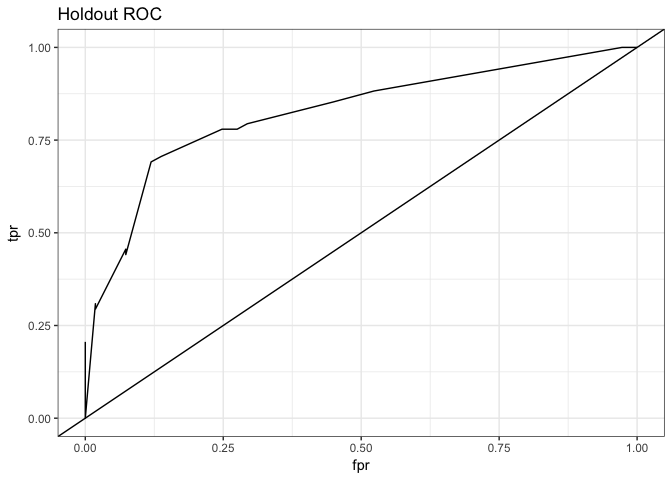
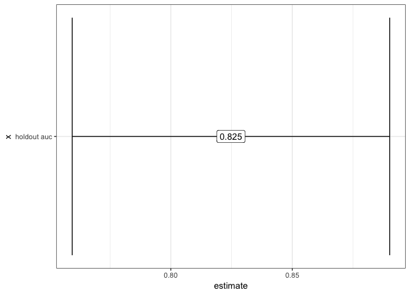

```r
library(tidyverse)
```

```
## ── Attaching packages ──────────────────────────────────────────────────────────────── tidyverse 1.2.1 ──
```

```
## ✔ ggplot2 2.2.1     ✔ purrr   0.2.4
## ✔ tibble  1.4.2     ✔ dplyr   0.7.4
## ✔ tidyr   0.8.0     ✔ stringr 1.3.0
## ✔ readr   1.1.1     ✔ forcats 0.3.0
```

```
## ── Conflicts ─────────────────────────────────────────────────────────────────── tidyverse_conflicts() ──
## ✖ dplyr::filter() masks stats::filter()
## ✖ dplyr::lag()    masks stats::lag()
```

```r
library(caret)
```

```
## Loading required package: lattice
```

```
## 
## Attaching package: 'caret'
```

```
## The following object is masked from 'package:purrr':
## 
##     lift
```

```r
library(pROC)
```

```
## Type 'citation("pROC")' for a citation.
```

```
## 
## Attaching package: 'pROC'
```

```
## The following objects are masked from 'package:stats':
## 
##     cov, smooth, var
```

```r
library(magrittr)
```

```
## 
## Attaching package: 'magrittr'
```

```
## The following object is masked from 'package:purrr':
## 
##     set_names
```

```
## The following object is masked from 'package:tidyr':
## 
##     extract
```


### Data  


```r
labeled_df <- read_csv('data/train.csv', col_types = cols(
        PassengerId = col_integer(),
        Survived = col_integer(),
        Pclass = col_integer(),
        Name = col_character(),
        Sex = col_character(),
        Age = col_double(),
        SibSp = col_integer(),
        Parch = col_integer(),
        Ticket = col_character(),
        Fare = col_double(),
        Cabin = col_character(),
        Embarked = col_character())
        ) %>% 
        mutate(Survived = factor(Survived, levels = c(0,1), 
                                         labels = c('no_survive', 'survive') ))

submission_df <- read_csv('data/test.csv', col_types = cols(
        PassengerId = col_integer(),
        Pclass = col_integer(),
        Name = col_character(),
        Sex = col_character(),
        Age = col_double(),
        SibSp = col_integer(),
        Parch = col_integer(),
        Ticket = col_character(),
        Fare = col_double(),
        Cabin = col_character(),
        Embarked = col_character()
))
```

### Determine Predictors  

Which fields are present in both datasets?  


```r
combined_data <- submission_df %>% 
        mutate(IsTrain = FALSE) %>%
        bind_rows(mutate(labeled_df, IsTrain = TRUE))

combined_data %>%
        group_by(IsTrain) %>%
        summarise_all(~sum(is.na(.x)))
```

```
## # A tibble: 2 x 13
##   IsTrain PassengerId Pclass  Name   Sex   Age SibSp Parch Ticket  Fare
##   <lgl>         <int>  <int> <int> <int> <int> <int> <int>  <int> <int>
## 1 FALSE             0      0     0     0    86     0     0      0     1
## 2 TRUE              0      0     0     0   177     0     0      0     0
## # ... with 3 more variables: Cabin <int>, Embarked <int>, Survived <int>
```

Select the non-missing features that would make sense as predictors


```r
predictors <- combined_data %>%
        select_if(~sum(is.na(.x)) == 0) %>%
        select(-PassengerId,-Name,-Ticket, -IsTrain) %>%
        names()

predictors
```

```
## [1] "Pclass" "Sex"    "SibSp"  "Parch"
```

### Split training/holdout  


```r
set.seed(100)

train_index <- createDataPartition(labeled_df$Survived, p = 0.8, list = FALSE)

train_df <- labeled_df[train_index,]

holdout_df <- labeled_df[-train_index,]
```

### xgbTree model  


```r
set.seed(101)

ctrl <- trainControl(method = "repeatedcv",
                     classProbs = T,
                     summaryFunction = twoClassSummary,
                     number = 10, 
                     repeats = 5,
                     savePredictions = T)

xgbTree_train <- train(Survived ~ .,
                       data = train_df[,c('Survived',predictors)],
                       method = "xgbTree",
                       trControl = ctrl,
                       metric = 'ROC'
)
```

### Model summary  


```r
confusionMatrix(xgbTree_train)
```

```
## Cross-Validated (10 fold, repeated 5 times) Confusion Matrix 
## 
## (entries are percentual average cell counts across resamples)
##  
##             Reference
## Prediction   no_survive survive
##   no_survive       54.1    12.9
##   survive           7.5    25.5
##                             
##  Accuracy (average) : 0.7958
```

### Holdout performance  


```r
holdout_preds <- predict(xgbTree_train, newdata = holdout_df, type = 'prob') %>%
        add_column(
                prediction = predict(xgbTree_train, 
                                     newdata = holdout_df, 
                                     type = 'raw'))

holdout_roc <- roc(holdout_df$Survived, holdout_preds$survive)

holdout_roc_df <- holdout_roc %$%
        tibble(tpr = sensitivities, fpr = 1 - specificities)
```

#### Confusion Matrix  


```r
confusionMatrix(holdout_df$Survived,holdout_preds$prediction)
```

```
## Confusion Matrix and Statistics
## 
##             Reference
## Prediction   no_survive survive
##   no_survive         96      13
##   survive            21      47
##                                           
##                Accuracy : 0.8079          
##                  95% CI : (0.7421, 0.8632)
##     No Information Rate : 0.661           
##     P-Value [Acc > NIR] : 1.155e-05       
##                                           
##                   Kappa : 0.5849          
##  Mcnemar's Test P-Value : 0.2299          
##                                           
##             Sensitivity : 0.8205          
##             Specificity : 0.7833          
##          Pos Pred Value : 0.8807          
##          Neg Pred Value : 0.6912          
##              Prevalence : 0.6610          
##          Detection Rate : 0.5424          
##    Detection Prevalence : 0.6158          
##       Balanced Accuracy : 0.8019          
##                                           
##        'Positive' Class : no_survive      
## 
```

#### ROC curve  


```r
holdout_roc_df %>%
        ggplot(aes(fpr,tpr)) +
        geom_line() +
        geom_abline(slope = 1, intercept = 0) +
        labs(title = 'Holdout ROC') +
        theme_bw()
```

<!-- -->

#### AUC  


```r
holdout_auc <- ci.auc(holdout_roc) %>%
        as.numeric() %>%
        tibble(value = .) %>%
        mutate(description = c('lower','estimate','upper')) %>%
        spread(description, value)

holdout_auc %>%
        ggplot(aes('holdout auc', y = estimate) ) +
        geom_errorbar(aes(ymin = lower, ymax = upper)) +
        geom_label(aes(label = round(estimate, 3))) + 
        coord_flip() +
        theme_bw()
```

<!-- -->

### Submission Predictions  


```r
submission_preds <- predict(xgbTree_train, newdata = submission_df) 

submission_output <- submission_df %>%
        select(PassengerId) %>%
        mutate(Survived = if_else(submission_preds == 'survive',1,0))

write.csv(submission_output, 'predictions/submission.csv', row.names = F)
```

